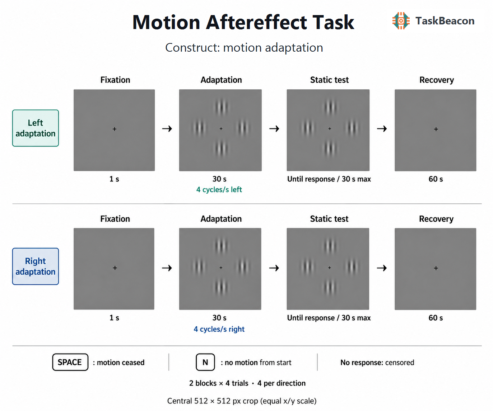

# Motion Aftereffect Task

| Field                | Value                        |
|----------------------|------------------------------|
| Name | Motion Aftereffect Task |
| Version | 0.1.0 |
| URL / Repository | https://github.com/TaskBeacon/T000135-motion-aftereffect-task |
| Short Description | Four translating Gabor patches followed by a stationary subjective-duration test |
| Created By | TaskBeacon |
| Date Updated | 2026-08-31 |
| PsyFlow Version | Shared public revision05997f98750d24d0745dd6d3b01105a002f11b5b |
| PsychoPy Version | 2025.2.4 |
| Modality | Visual; keyboard self-report |
| Language | Chinese |
| Voice Name | zh-CN-YunyangNeural configured; voice disabled |

## 1. Task Overview

This fixed-pixel task adapts the translation condition and static-test duration method of Bex, Metha, and Makous (1999), Experiment 1. Four Gaussian-windowed vertical gratings drift left or right for30s, then remain stationary. Participants report when apparent motion has ceased, or explicitly report that no apparent motion was present from the start. Eight trials provide four estimates per direction. It is a software implementation of a subjective report paradigm, not a calibrated motion threshold, validated human aftereffect, or clinical assessment. Harris, Morgan, and Still (1981), supplied as the primary reference, concerns moving observers and was available at abstract level; its physical self-motion procedure is not represented as reproduced here.

## 2. Task Flow

### Block-Level Flow

| Step | Implementation |
|---|---|
| Setup | Collect a three-digit subject ID; load YAML; initialize gray1280×800pixel window, keyboard, mock/configured triggers and preloaded stimuli. Refuse a window with either dimension below600pixels. |
| Instructions | Chinese `instruction`; press SPACE to continue. Maintain central fixation and stable viewing distance/window size. |
| Schedule | Overall seed135031 yields shared TaskSettings block seeds; built-in BlockUnit balanced generation shuffles two left and two right trials per block. No adaptive controller. |
| Blocks | Execute four trials; save cumulative CSV after each block. `block_break` waits for SPACE between blocks. |
| End | Save a report-category summary; `good_bye` waits for SPACE; close the window and trigger runtime. No accuracy/ability feedback. |

### Trial-Level Flow

| Phase | Stimuli and behavior | Human duration |
|---|---|---|
| Fixation | `fixation`, a12pixel central darkcross on gray; reset patch phases to[0,0] before this trial. |1s|
| Adaptation | `patch_0` through `patch_3` plus cross; all vertical carriers translate in the same direction. Shared runtime varies horizontal phase at−4cycles/s left or+4cycles/s right using its stage clock. |30s requested|
| Static test | Same four patches retain their actual last submitted phases; no phase reset, added prompt or drawn illusory motion. SPACE records cessation; N records no apparent motion from the start. |Until first valid key, at most30s|
| Recovery | Only central cross on gray. This selected60s rest has not been demonstrated to restore baseline in an individual observer. |60s, including after the last trial|

### Controller Logic

| Component | Rule |
|---|---|
| Scheduling | Balanced directions per block; seeded order; no stimulus or duration adaptation from responses. |
| Phase | Initial[0,0]; positive horizontal phase moves the cosine carrier right. Vertical phase is preserved. The static test holds the actual end phase, rather than recomputing a nominal120cycle endpoint. |
| Software timing quality | Record actual flip intervals, phase samples, adaptation-to-static exposure and transition gap. Flag exposure error greater than50ms, frame gap greater than50ms, or transition gap greater than50ms. The threshold is an engineering exclusion rule, not a psychophysical standard. |

### Other Logic

| Report | Stored result |
|---|---|
| SPACE | `report_category=motion_ceased`; `reported_duration_s` is static-test response time. |
| N | `report_category=no_apparent_motion`; reported duration0, while actual motor/report RT remains in `report_rt_s`. |
| Missing/invalid | `report_category=missing`; durationnull and `duration_censored=true`. This may reflect ongoing sensation or noncompliance and is never imputed as zero or as the30s deadline. |
| Technical failure | Raw report is retained; `valid_duration_report=false` when `technical_timing_ok=false`. Neither a response nor successful automation proves a human aftereffect. |

## 3. Configuration Summary

Settings below are from `config/config.yaml`. `config_qa.yaml` retains nominal timings but opts into shared0.05duration scaling and four synthetic trials. Simulation configs explicitly shorten phases for software checks; none of these shortened runs measures human adaptation.

### a. Subject Info

| Field | Meaning |
|---|---|
| subject_id | Integer101–999, exactly three digits; collected by localized subject form. |

### b. Window Settings

| Parameter | Value |
|---|---|
| size / units |1280×800 / pix|
| background |#808080|
| screen / fullscreen |0 / false|
| physical calibration |None: no enforced viewing distance, pixel-density calibration, gamma measurement or gaze tracking. No cycles/degree claim. |

### c. Stimuli

| Name | Type | Description |
|---|---|---|
| patch_0–patch_3 |GratingStim|256×256pixels each; centers[−128,0],[128,0],[0,128],[0,−128]; sine texture convention yielding cosine at zero phase; sf1/32cycles/pixel; nominal contrast0.4; Gaussian mask with sd5 (sigma25.6pixels); texRes1024.|
| fixation |TextStim|Darkcross, height12pixels, center[0,0].|
| instruction / block_break / good_bye |TextStim|Chinese SimHei, height24pixels, explicit line breaks, wrapWidth1100pixels.|

The ideal digital modulation is `0.5 + 0.2*exp(−(x²+y²)/(2*25.6²))*cos(2π*(x/32−phase))` around each patch center. Actual native texture sampling and browser alpha quantization may differ slightly. The final active stimuli use shared procedural gratings, not the experimental MP4 files retained as rejected feasibility evidence. The latter were decoded and audited offline but their native playback strategy failed validation.

### d. Timing

| Phase | Duration |
|---|---|
| Fixation |1s|
| Adaptation |30s requested, refresh-quantized; actual exposure and all phase/flip samples retained|
| Static test |0–30s according to valid response|
| Recovery |60s|
| Trial count |2blocks ×4trials =8, four per direction|

### e. Triggers

| Event | Code |
|---|---|
| experiment_start |1|
| fixation_onset |10|
| adaptation_onset |20|
| static_onset |30|
| motion_ceased |31|
| no_motion |32|
| omission |39|
| recovery_onset |40|
| experiment_end |99|

The default driver is mock; no external EEG/device timing has been validated. Native onsets are scheduled through shared flip callbacks. Browser event timestamps represent software stage timing, not physical display onset.

Run from the task directory with `python main.py human`, `python main.py qa`, `python main.py sim --config config/config_scripted_sim.yaml`, or `python main.py sim --config config/config_sampler_sim.yaml`. Shared PsyFlow and PsychoPy must already be installed; this repository does not contain a private runtime. Outputs are local and ignored by Git. The `validation` folder distinguishes actual runs, failed feasibility attempts, static tests and shortened synthetic runs.

## 4. Methods (for academic publication)

The operational method was adapted from Experiment1 of Bex etal.(1999), which used Gaussian-windowed gratings,30s adaptation and a stationary test with a cessation report. Only translation is implemented here: four vertical carrier patches at the cardinal positions moved together either leftward or rightward. The source’s spatial parameters (2degrees eccentricity,0.4degree Gaussian sigma and2cycles/degree) were converted to fixed-pixel ratios, giving128pixel center offsets,25.6pixel sigma and a32pixel period. The source’s4cycles/s temporal frequency and nominal40%digital contrast were retained. Source75Hz refresh, calibrated55cd/m² mean luminance and physical visual angles were not reproduced or claimed.

Participants were instructed to fixate a centralcross throughout. Each trial contained1s fixation,30s requested adaptation, a stationary self-report interval of at most30s, and60s recovery. The test held the last actual submitted grating phases. SPACE indicated disappearance of apparent motion; an added N category indicated no apparent motion from test onset. No response was classified as missing/censored with a null duration, rather than interpreted as evidence that an aftereffect persisted to the ceiling. Two balanced randomized blocks yielded four trials per direction. The1s lead-in,30s ceiling,60s recovery interval, key mapping, block grouping and explicit no-motion option are implementation adaptations or inferences documented in `references/task_logic_audit.md`; recovery was not validated as complete washout.

The software retains phase trajectories, native flip timings, static transition timing, report RTs and technical exclusion flags. Native visual checks compare shader-rendered images to an independent fitted carrier/Gaussian model; browser validation examines actual procedural canvas output and animation submission intervals. These are software and digital-rendering checks. Native GL front-buffer screenshots were black and OS ImageGrab was unavailable; actual shader back-buffer captures were used, with this limitation retained. Human startup used an explicitly synthetic identity and a real window/preload/instruction checkpoint; automated subject-dialog interaction was not validated. These checks do not establish photometric calibration, gaze compliance, a human motion aftereffect, normative distributions or clinical validity. The supplied Harris etal.(1981) reference is documented separately because its moving-observer context is not the static-observer protocol implemented here.

Data interpretation: raw browser `hit` is the shared key-acceptance flag (true for an accepted report, false at timeout), not accuracy, detection or proof of MAE. The derived reduced `static_test_hit` is deliberately normalized to null. Analyze report_category, reported_duration_s and validity flags. N latency remains in report_rt_s even though reported_duration_s is zero.
